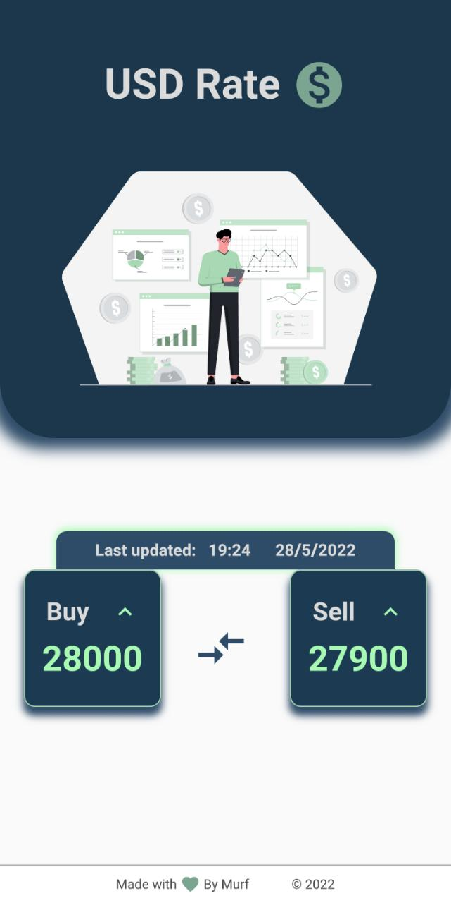

# USD Rate

A flutter application to track currency exchange for LBP and USD.
Due to black market rate, and inflation in lebanon, the exchange rate is not accurate.

Disclaimer:
We are not responsible for any loss of money due to the exchange rate. It is displayed as is without any change. 

# Preview

# How it works
It uses an api that i created [link to repo](https://github.com/Murf-y/LBP-DollarRate-API), and display the information.
You can refresh the page to get the latest information.

# How to use it
Download the apk for android and run it.

(Note: IOS is not yet supported)

# LICENSE and CONTRIBUTORS
MIT License, open source. Open for contribution. 

